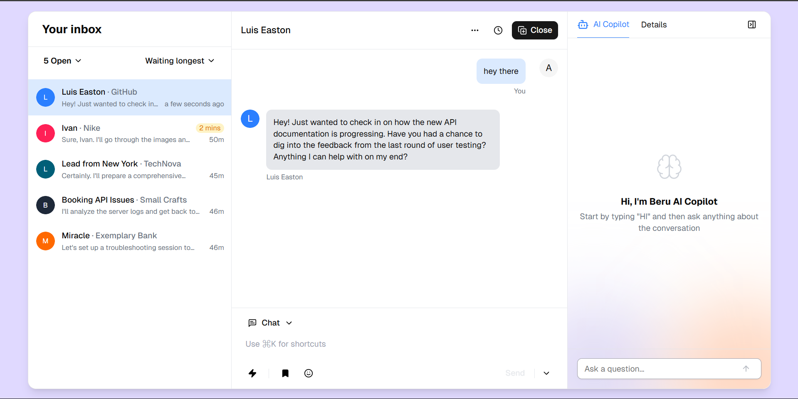

This is a [Next.js](https://nextjs.org) project bootstrapped with [`create-next-app`](https://nextjs.org/docs/app/api-reference/cli/create-next-app).

## Getting Started

First, run the development server:

```bash
npm run dev
# or
yarn dev
# or
pnpm dev
# or
bun dev
```

Open [http://localhost:3000](http://localhost:3000) with your browser to see the result.

You can start editing the page by modifying `app/page.tsx`. The page auto-updates as you edit the file.

This project uses [`next/font`](https://nextjs.org/docs/app/building-your-application/optimizing/fonts) to automatically optimize and load [Geist](https://vercel.com/font), a new font family for Vercel.

## Learn More

To learn more about Next.js, take a look at the following resources:

- [Next.js Documentation](https://nextjs.org/docs) - learn about Next.js features and API.
- [Learn Next.js](https://nextjs.org/learn) - an interactive Next.js tutorial.

You can check out [the Next.js GitHub repository](https://github.com/vercel/next.js) - your feedback and contributions are welcome!

## Deploy on Vercel

The easiest way to deploy your Next.js app is to use the [Vercel Platform](https://vercel.com/new?utm_medium=default-template&filter=next.js&utm_source=create-next-app&utm_campaign=create-next-app-readme) from the creators of Next.js.

Check out our [Next.js deployment documentation](https://nextjs.org/docs/app/building-your-application/deploying) for more details.

# 📨 AI Chat Inbox

A smart AI-powered inbox interface that allows you to chat with any user — where every “user” is actually an intelligent assistant! This interface simulates realistic multi-threaded conversations with different AI personas, making it perfect for brainstorming, task management, and exploration.

---

## 🚀 Features

### 💬 Realistic AI Conversations
- Every inbox user (like "Luis Easton" or "Ivan") is an AI persona.
- You can discuss any topic: tech, ideas, tasks, or just casual chat.
- Great for exploring ideas with multiple assistant roles.

### 🧠 Sidebar AI Tools
- **Summaries**: Quickly summarize the conversation thread.
- **Insights**: Ask for detailed info, explanations, or follow-ups.
- **Search**: Quickly find key points or last discussions.

### 🕓 Smart Timestamps
- Clearly see how recently each chat was updated (e.g., “2 mins”, “46m”).
- Prioritize replies based on freshness or urgency.

### 🔍 Preview & Context
- Message previews show a snippet of the last message for quick skimming.
- Easy to pick up where you left off in any conversation.

### 🧷 Pin & Prioritize (planned)
- Organize your inbox by pinning important chats.
- Tag conversations based on category or importance.

---

## 🖼 UI Preview




---

## 🛠 Tech Stack

- **Frontend**: React (with TypeScript) / Next.js
- **State Management**: Zustand
- **Styling**: Tailwind CSS / Shadcn UI
- **AI Integration**: OpenAI API (or similar)

---

## 🧑‍💻 Getting Started

```bash
git clone https://github.com/Animeshhit/ai-chat-agent
cd ai-chat-agent
npm install
npm run dev

